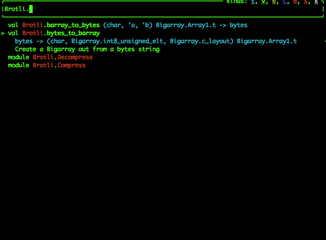

These are OCaml bindings to the new compression library released by
Google called [brotli](https://github.com/google/brotli), uses `Bigarrays` for memory efficiency and `Lwt`
for concurrency.

# Installation

I assume that you have [opam](https://opam.ocaml.org) installed, it is OCaml's package manager.
All you have to do, until I get this up on `opam` is:

```shell
$ opam pin add brotli .
```

and you'll have the `Brotli` module to use.

# Brotli Library usage

The `Brotli` module contains helper functions and two submodules
called `Compress` and `Decompress`. Both are straightforward and are
well commented, look at the `mli` or you can look at this animation
which goes over the public API



Decompressing is straightforward with not much wiggle room,
compression however can take a few parameters. You don't actually have
to pick any values though because the library defaults to the same
settings that Google picked in their Python bindings, but of course
you can override to your preferences.

# Issues

1.  I suck at `C++` so its maybe not the most idiomatic but it works.
2.  Some low hanging fruit available for refactoring, leaving it for a
    pull request for a developer eager to get into open-source.
